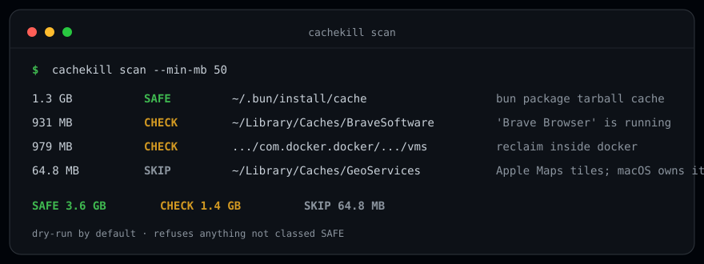

<div align="center">

# cachekill

**Know what is safe to delete before you delete it.**




[Quick start](#quick-start) &middot; [How classification works](#how-classification-works) &middot; [The registry](#the-registry) &middot; [Design notes](#design-notes)

</div>

On October 1 this machine's disk hit 99%. I cleared 6.4 GB of caches, and free
space went *down* anyway: Docker's VM image quietly ate every reclaimed byte
back. Nothing told me which caches were pure cache, which were load-bearing,
and which were user content wearing a cache's name.

cachekill is that missing tool. It walks your machine's cache directories,
classifies every one, and deletes only what survived the classification.

## The three classes

| | | |
|---|---|---|
|  | Pure cache. Deleting costs re-download time, nothing else. | `delete --apply` may remove it |
|  | Probably fine, but one thing needs verifying: the owning app is running, it is user-managed state, or cachekill simply does not know the path. | listed, never auto-deleted |
|  | User content, system-managed dirs, or config disguised as cache. | listed for visibility only |

Unknown paths are CHECK, never SAFE. Deletion is dry-run by default and refuses
anything that did not scan as SAFE.

```text
$ cachekill scan --min-mb 50
      SIZE  CLASS  PATH                                                                  NOTE
    1.3 GB  SAFE   ~/.bun/install/cache                                                    bun package tarball cache
  979.0 MB  CHECK  ~/Library/Containers/.../vms/0                                          Docker VM disk image. Reclaim INSIDE docker (builder/image p
  931.5 MB  SAFE   ~/Library/Caches/BraveSoftware                                          Brave browser HTTP cache
  431.7 MB  CHECK  ~/.npm/_npx                                                             npx-installed packages; regenerable but re-fetches on next n
  375.8 MB  SAFE   ~/.cargo/registry/src                                                   extracted crate sources
  375.2 MB  SAFE   ~/.npm/_cacache                                                         npm content-addressed cache
  361.5 MB  SAFE   ~/.cache/uv                                                             uv wheel + index cache
  101.1 MB  SAFE   ~/.cache/prek                                                           prek (pre-commit) hook virtualenvs
   64.8 MB  SKIP   ~/Library/Caches/GeoServices                                            Apple Maps tiles; macOS owns it
   63.5 MB  SAFE   ~/.cache/node                                                           corepack shims/keys cache
   58.4 MB  SAFE   ~/.cargo/registry/index                                                 crates.io index clone
   54.5 MB  CHECK  ~/Library/Caches/bun                                                    bun toolchain cache, 'bun' is running; quit it first
   52.7 MB  SAFE   ~/.cargo/registry/cache                                                 crates.io tarball cache

  SAFE  total: 3.6 GB
  CHECK total: 1.4 GB
  SKIP  total: 64.8 MB
```

## Quick start

No dependencies, no install step. Python 3.10+ stdlib:

```bash
git clone https://github.com/Matthew-Selvam/cachekill
python3 cachekill/cachekill.py scan
```

macOS-first (`~/Library/Caches`, `~/Library/Containers`); the `~/.cache`,
`~/.npm`, `~/.bun`, `~/.gradle`, and `~/.cargo` conventions work on Linux too.

## Usage

```bash
python3 cachekill.py scan                    # classify everything
python3 cachekill.py scan --min-mb 100       # hide the small stuff
python3 cachekill.py explain <path>          # why is this classified X?
python3 cachekill.py delete                  # dry-run: what would SAFE deletion free?
python3 cachekill.py delete --apply          # actually delete SAFE entries
python3 cachekill.py delete --apply --path ~/.cache/puppeteer   # one entry
python3 cachekill.py scan --json             # machine-readable
```

`explain` is the escape hatch from the registry's opinions:

```text
$ cachekill explain ~/.cache/prek
path    /Users/you/.cache/prek
class   SAFE  (match: exact, 101.1 MB, 3239 files)
why     prek (pre-commit) hook virtualenvs
regen   prek re-creates envs on next run
```

Exit codes: `0` ok, `2` nothing matched, `3` a path you explicitly named was
refused by a safety rule.

## How classification works

**Liveness-aware.** Browser caches are SAFE, after you quit the browser. If
Chrome, Brave, Firefox, Spotify, bun, or python is running, the entry downgrades
to CHECK with the reason attached (snapshot from an earlier run, with Brave open):

```text
931.2 MB  CHECK  ~/Library/Caches/BraveSoftware   Brave browser HTTP cache, 'Brave Browser' is running
```

**Allocated bytes, not apparent size.** Docker's `Docker.raw` reports 24 GB
apparent while allocating under 1 GB after a prune. Tools that sum apparent
sizes will tell you a file is eating your disk when it isn't. cachekill uses
du-style allocated blocks, so sparse files cannot flatter the numbers.

**Docker is a CHECK, never a target.** The space inside Docker lives in the VM
image. You reclaim it with `docker builder prune --all` and
`docker image prune -a` while the daemon runs. Deleting `Docker.raw` from the
outside just corrupts the VM. The CHECK note says exactly that.

**`~/.ollama/models` is SKIP on purpose.** Model blobs look like cache but are
config: which model your projects pin lives in their source code, not on disk.
Removing the wrong one silently breaks a vision connector. (This happened.)
Grep your repos for model pins before any `ollama rm`.

## The registry

Every rule earned its class during a real disk-reclaim session. 41 rules cover
package managers (npm, bun, uv, pip, cargo, gradle, go), browser and app
caches, ML model caches (huggingface, torch, chroma), tool binaries
(puppeteer, playwright, mongodb), and the deliberate skips.

<details>
<summary>Full registry, generated from source</summary>

<!-- REGISTRY-TABLE:START -->

| Path | Class | Why | Comes back |
|---|---|---|---|
| `~/.bun/install/cache` | **SAFE** | bun package tarball cache | bun install re-downloads on demand |
| `~/.npm/_cacache` | **SAFE** | npm content-addressed cache | npm cache verify / next install |
| `~/.npm/_logs` | **SAFE** | npm debug logs | next npm run |
| `~/.cache/uv` | **SAFE** | uv wheel + index cache | next uv sync/pip |
| `~/Library/Caches/pip` | **SAFE** | pip download cache | next pip install |
| `~/Library/Caches/bun` | **SAFE** | bun toolchain cache | next bun run |
| `~/go/pkg/mod` | **CHECK** | Go module cache. Clean with `go clean -modcache`, not by rm | go mod download |
| `~/.cache/puppeteer` | **SAFE** | puppeteer Chromium builds | next puppeteer install re-downloads |
| `~/Library/Caches/ms-playwright` | **SAFE** | playwright browser binaries | npx playwright install |
| `~/.cache/huggingface` | **SAFE** | HF hub models, re-download on demand | transformers snapshot_download |
| `~/.cache/torch` | **SAFE** | torch hub checkpoints | on demand |
| `~/.cache/chroma/onnx_models` | **SAFE** | chroma default embedder model | chroma re-downloads on first use |
| `~/.cache/mongodb-binaries` | **SAFE** | mongodb runner binaries | mongodb-memory-server re-downloads |
| `~/.cache/ms-playwright` | **SAFE** | playwright browser binaries (Linux path) | npx playwright install |
| `~/.cache/prek` | **SAFE** | prek (pre-commit) hook virtualenvs | prek re-creates envs on next run |
| `~/.cache/node` | **SAFE** | corepack shims/keys cache | corepack re-fetches |
| `~/.cache/typescript` | **SAFE** | tsc incremental buildinfo | next tsc build |
| `~/.gradle/caches` | **SAFE** | gradle dependency + build cache | next gradle build |
| `~/.cargo/registry/cache` | **SAFE** | crates.io tarball cache | cargo fetch |
| `~/.cargo/registry/src` | **SAFE** | extracted crate sources | cargo fetch |
| `~/.cargo/registry/index` | **SAFE** | crates.io index clone | cargo fetch re-clones |
| `~/Library/Caches/com.spotify.client` | **SAFE** | Spotify audio/HTTP cache | Spotify rebuilds it |
| `~/Library/Caches/BraveSoftware` | **SAFE** | Brave browser HTTP cache | Brave rebuilds it |
| `~/Library/Caches/Google/Chrome` | **SAFE** | Chrome HTTP cache | Chrome rebuilds it |
| `~/Library/Caches/Firefox` | **SAFE** | Firefox HTTP cache | Firefox rebuilds it |
| `~/Library/Caches/GeoServices` | **SKIP** | Apple Maps tiles; macOS owns it | n/a |
| `~/.npm/_npx` | **CHECK** | npx-installed packages; regenerable but re-fetches on next npx | next npx <pkg> |
| `~/Library/Caches/com.apple.*` | **SKIP** | system-managed; macOS owns it | n/a |
| `~/Library/Caches/CloudKit` | **SKIP** | system-managed; macOS owns it | n/a |
| `~/Library/Caches/com.apple.helpd` | **SKIP** | system-managed; macOS owns it | n/a |
| `~/.ollama/models` | **SKIP** | local LLM blobs. Grep your repos for model pins before `ollama rm` | n/a |
| `~/Library/Containers/com.docker.docker` | **CHECK** | Docker VM disk image. Reclaim INSIDE docker (builder/image prune), never by deleting Docker.raw | n/a |
| `~/Downloads` | **SKIP** | user content | n/a |
| `~/.rustup` | **CHECK** | rustup toolchains. Deleting breaks offline builds | rustup toolchain install |
| `~/ComfyUI-Installs` | **SKIP** | user content | n/a |
| `~/.claude` | **SKIP** | agent state + managed plugin checkouts | n/a |
| `~/.openclaude` | **SKIP** | agent state + managed plugin checkouts | n/a |
| `~/.hermes` | **SKIP** | active agent session state | n/a |
| `~/Library/Group Containers` | **SKIP** | app-owned data, e.g. WhatsApp message media (73 GB observed). Clean from inside the app, never by rm | n/a |
| `~/Library/Application Support` | **SKIP** | app state, not cache; includes agent/Cowork VM bundles (claudevm.bundle rootfs.img ~10 GB each). App-managed | n/a |
| `~/node_modules` | **CHECK** | project dependencies. Deleting is safe but breaks running dev servers | package manager install |

<!-- REGISTRY-TABLE:END -->

</details>

Add a `Rule(rel, cls, note, regen, app)` to `REGISTRY` in `cachekill.py`.
Rules match longest-prefix-first; `Library/Caches/com.apple.*` wildcards match
last. If your tool's cache is misclassified, open an issue with `explain`
output before and after.

## Design notes

- **Classify first, delete second.** The interesting output is the table, not
  the freed bytes. The banner above is the product; deletion is the footnote.
- **Conservative by construction.** Unknown paths are CHECK. Refusals are loud
  (exit code 3, reason printed). There is no `--force`.
- **One file, stdlib only.** Auditable in a single sitting. Nothing to install,
  nothing to break.

## License

MIT
